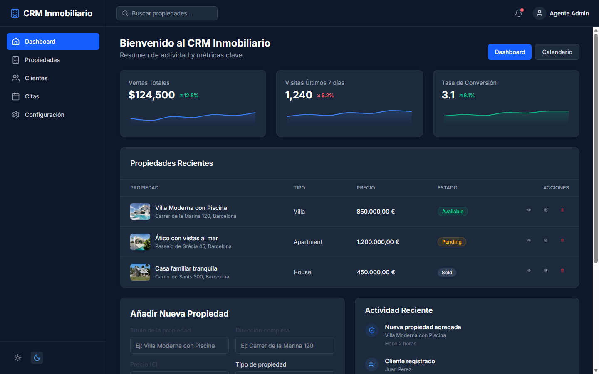
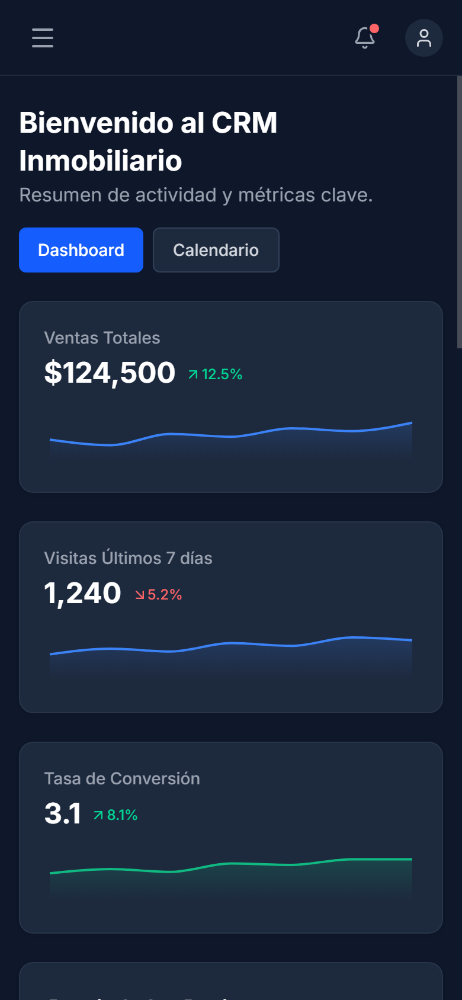

# InmoFlow CRM — Portal Inmobiliario & Gestión de Propiedades

[](https://github.com/alxnrocha/real-estate-crm/actions)
[](https://alxnrocha.github.io/real-estate-crm/)
[](https://www.typescriptlang.org/)
[](https://react.dev/)
[](https://tailwindcss.com/)
[](./LICENSE)

**InmoFlow CRM** es una solución web empresarial diseñada para agencias y agentes inmobiliarios. Permite administrar carteras de propiedades, programar citas y visitas de clientes, gestionar estados comerciales y visualizar métricas clave de ventas y rendimiento en tiempo real.

- 🌐 **Demo en Vivo (GitHub Pages):** [https://alxnrocha.github.io/real-estate-crm/](https://alxnrocha.github.io/real-estate-crm/)
- 📦 **Repositorio GitHub:** [https://github.com/alxnrocha/real-estate-crm](https://github.com/alxnrocha/real-estate-crm)

---

## 📸 Vistas Reales del Sistema

### 1. Vista Principal (Desktop)



### 2. Experiencia Responsive (Móvil)



---

## ✨ Características Principales

### 🚀 Experiencia de Usuario & Frontend
- **Directorio y Filtros Multicriterio de Inmuebles:** Filtrado en tiempo real por tipo de propiedad (piso, casa, local), rango de precio, número de habitaciones, ubicación y estado comercial (`Disponible`, `Reservado`, `Vendido`).
- **Dashboard Analítico con Recharts:** Métricas de volumen de ventas, tasa de conversión y distribución de visitas comerciales.
- **Formularios con Validación Estricta:** Creación y edición de inmuebles mediante React Hook Form y esquemas de validación con Zod.
- **Gestión de Estado Modular con Zustand:** Stores desacoplados para autenticación, gestión de catálogo y filtros globales.
- **Sistema de Calendario y Citas:** Organización visual de visitas presenciales y reuniones con clientes.

### 🛡️ Modelo de Base de Datos Relacional
- Esquema DDL SQL documentado en [`database/README.md`](./database/README.md) con entidades para agentes, clientes, inmuebles y visitas.

---

## 🏛️ Estructura del Proyecto

```text
08-real-estate-crm/
├── .github/workflows/ci.yml       # Pipeline de CI y Deploy automático en Pages
├── database/                      # Esquema relacional SQL y diagrama DER
│   ├── README.md
│   ├── schema.sql
│   └── seed.sql
├── screenshots/                   # Capturas de pantalla reales
│   ├── desktop.png
│   └── mobile.png
├── src/
│   ├── components/
│   │   ├── layout/                # Sidebar, Header y DashboardLayout
│   │   ├── properties/            # Tablas, filtros y modales de inmuebles
│   │   └── ui/                    # Primitivas accesibles (Button, Input, Card, Badge)
│   ├── services/                  # Clientes mock y llamadas asíncronas
│   ├── store/                     # Stores Zustand (Auth, Properties, Filters)
│   ├── types/                     # Definiciones de tipos TypeScript
│   ├── App.tsx                    # Shell de la aplicación
│   └── main.tsx                   # Entrada React 19
├── index.html                     # Entrypoint HTML5
└── vite.config.ts                 # Configuración de Vite y Tailwind v4
```

---

## ⚡ Guía de Inicio Rápido

### 1. Clonar e Instalar Dependencias
```bash
git clone https://github.com/alxnrocha/real-estate-crm.git
cd real-estate-crm
npm install
```

### 2. Iniciar en Modo Desarrollo
```bash
npm run dev
```

---

## 🔑 Credenciales de Demostración

| Rol | Correo Electrónico | Contraseña |
| :--- | :--- | :--- |
| **Agente Inmobiliario** | `agente@inmoflow.com` | `Password123!` |

*(La demo en GitHub Pages permite iniciar sesión con cualquier correo válido).*

---

## 🧪 Calidad de Código y Pruebas

```bash
# Compilar para producción
npm run build
```

---

## 📄 Licencia

Este proyecto está bajo la Licencia MIT. Consulte el archivo [LICENSE](./LICENSE) para más detalles.

**Autor:** [Alexandre Rocha](https://github.com/alxnrocha)
