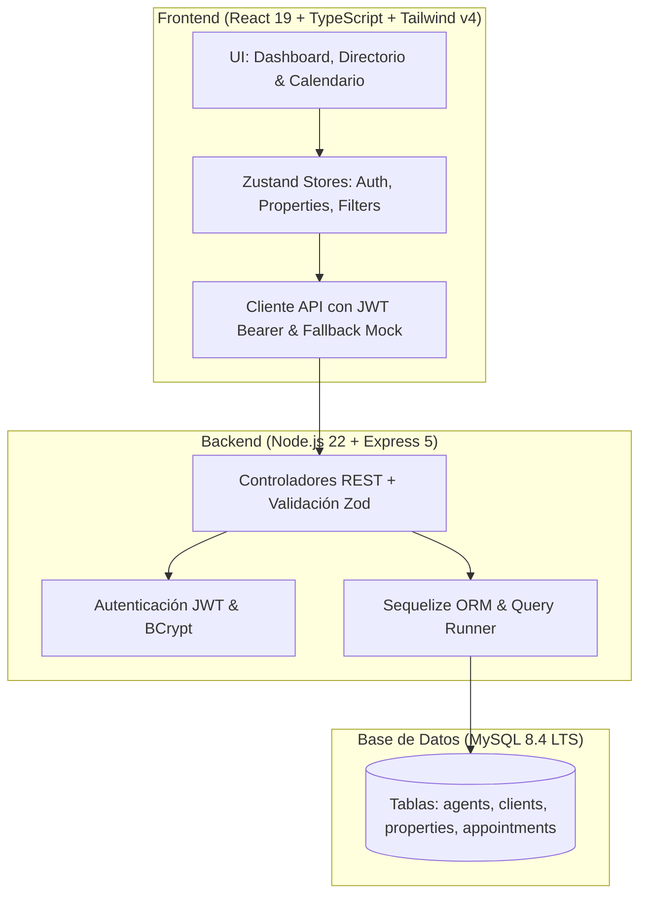

# InmoFlow CRM — Portal Inmobiliario & Gestión de Propiedades (Full Stack)

<div align="center">


**Plataforma web Full Stack para agencias y consultorías inmobiliarias con gestión de propiedades, control de prospectos cualificados, calendarización de visitas y modelo relacional MySQL 8.4 LTS.**

[🚀 Demo en Vivo](https://alxnrocha.github.io/real-estate-crm/) • [📂 Repositorio en GitHub](https://github.com/alxnrocha/real-estate-crm)

</div>

---

## 🏛️ Arquitectura del Sistema



---

## ✨ Características Principales

### 🚀 Frontend (React 19 + TypeScript + Tailwind CSS v4)

- **Directorio & Filtros Multicriterio:** Filtrado en tiempo real por tipo de propiedad, rango de precio, habitaciones, ubicación y estado (`Available`, `Sold`, `Rented`, `Pending`).
- **Dashboard Analítico con Recharts:** Métricas de volumen de ventas, tasa de conversión y distribución de visitas comerciales.
- **Formularios con Validación Zod:** Creación y edición de inmuebles mediante React Hook Form y esquemas fuertemente tipados.
- **Gestión de Estado Modular con Zustand:** Stores desacoplados para autenticación, catálogo de propiedades y filtros.

### 🛡️ Backend & Datos (Node.js 22 + Express 5 + Sequelize + MySQL 8.4 LTS)

- **Autenticación JWT & BCrypt:** Registro, login y perfil con control de roles (`admin`, `agent`).
- **Modelo Relacional de 4 Entidades:** `agents`, `clients`, `properties` y `appointments` con claves foráneas, restricciones de integridad e índices.
- **API REST Completa:** Endpoints para gestión de cartera, agenda de citas y analíticas.
- **Migraciones SQL Versionadas:** Runner que registra cada migración en `schema_migrations`.

---

## 🗂️ Estructura del Proyecto

```text
08-real-estate-crm/
├── server/                        # Backend (Node.js 22 + Express 5 + Sequelize + MySQL)
│   ├── migrations/                # Migraciones SQL versionadas
│   ├── src/                       # Controladores, modelos, rutas, schemas
│   ├── .env.example
│   └── package.json
├── src/                           # Frontend (Vite + React 19 + Tailwind v4)
│   ├── components/                # Layout, auth, dashboard, properties, calendar
│   ├── services/api.ts            # Cliente HTTP híbrido (fetch + Bearer)
│   ├── store/                     # Stores Zustand
│   └── App.tsx
├── package.json
└── vite.config.ts
```

---

## 🚀 Instalación y Puesta en Marcha

### Prerrequisitos

- Node.js `>= 20.0.0`
- npm `>= 10.0.0`
- MySQL 8.4 LTS (local o en contenedor)

### Pasos de Ejecución

```bash
# 1. Clonar el repositorio
git clone https://github.com/alxnrocha/real-estate-crm.git
cd real-estate-crm

# 2. Instalar dependencias
npm install
npm install --prefix server

# 3. Iniciar entorno de desarrollo
npm run dev            # Frontend (http://localhost:5173)
npm run dev:server     # Backend  (http://localhost:5000/api/v1)
```

---

## 🔑 Credenciales de Demostración

| Rol                     | Correo Electrónico         | Contraseña     |
| ----------------------- | -------------------------- | -------------- |
| **Administrador**       | `agente@inmoflow.com`      | `Password123!` |
| **Agente Inmobiliario** | `laura.vidal@inmoflow.com` | `Password123!` |

---

## 🛠️ Tecnologías Utilizadas

| Capa                    | Tecnología               | Aspectos Clave                                          |
| ----------------------- | ------------------------ | ------------------------------------------------------- |
| **Frontend**            | React 19, TypeScript 5.8 | UI de alta densidad, componentes modulares              |
| **Backend**             | Node.js 22, Express 5    | API REST, middleware de autenticación JWT               |
| **Base de Datos**       | MySQL 8.4 LTS, Sequelize | Esquema relacional con claves foráneas e índices B-Tree |
| **Estado & Validación** | Zustand 5.0, Zod         | Stores reactivos, validación de esquemas tipados        |
| **Visualización**       | Recharts 2.15            | Gráficos analíticos de ventas y visitas                 |
| **Despliegue**          | GitHub Pages             | Despliegue estático continuo y optimizado               |

---

<div align="center">
  <sub>Desarrollado con dedicación por <a href="https://github.com/alxnrocha">Alex Rocha</a> • Proyecto 08 del Portafolio Profesional Frontend.</sub>
</div>
