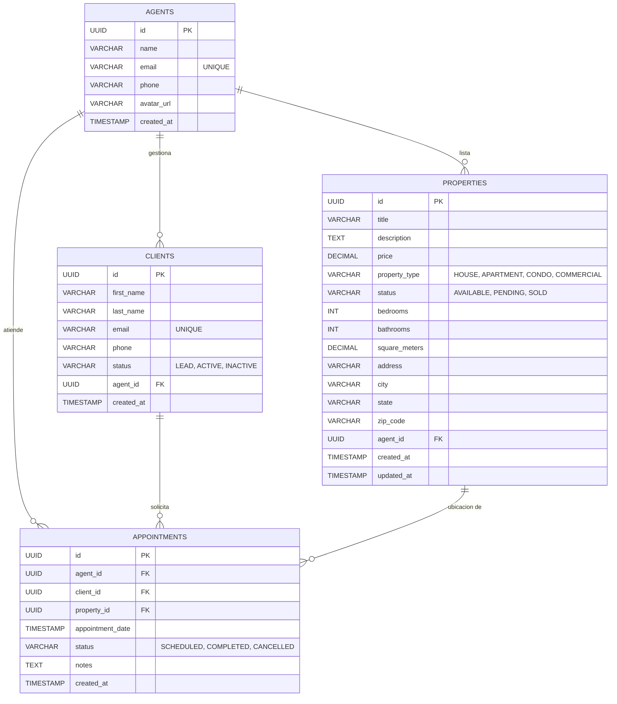

# Database Schema (DER)

Este documento contiene el Diagrama Entidad-Relación (DER) interactivo del sistema, generado a partir del archivo `schema.sql`.

## Diagrama Entidad-Relación

## Relaciones Principales

- **Agents (Agentes)** pueden tener asignados múltiples **Clients (Clientes)** y ser responsables de múltiples **Properties (Propiedades)**.
- **Appointments (Citas/Visitas)** conectan un Agente, un Cliente y opcionalmente una Propiedad en una fecha y hora específicas.
- Si un agente es eliminado, sus propiedades asignadas también se eliminan (`ON DELETE CASCADE`), al igual que sus citas. Los clientes pasan a tener `agent_id` nulo (`ON DELETE SET NULL`).
