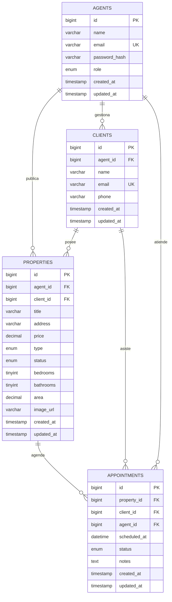

# Modelo de Base de Datos — Real Estate CRM

Este documento describe el modelo de datos **teórico** del proyecto. La aplicación actual funciona con datos mockeados en el frontend (`src/utils/mockData.ts` y `src/services/mockApi.ts`); este esquema es la base de datos relacional que soportaría el backend real en una evolución futura del CRM.

> **Motor objetivo:** MySQL 8.4 LTS · **Charset:** `utf8mb4` · **Motor de tablas:** InnoDB

## Entidades

| Tabla | Descripción |
| :--- | :--- |
| `agents` | Agentes inmobiliarios que gestionan propiedades y clientes. |
| `clients` | Clientes (propietarios o compradores) asignados a un agente. |
| `properties` | Inmuebles listados por la agencia. |
| `appointments` | Citas/visitas programadas sobre una propiedad. |

## Diagrama Entidad-Relación (DER)

```mermaid
erDiagram
    AGENTS ||--o{ CLIENTS : "gestiona"
    AGENTS ||--o{ PROPERTIES : "publica"
    CLIENTS ||--o{ PROPERTIES : "posee"
    PROPERTIES ||--o{ APPOINTMENTS : "agenda"
    CLIENTS ||--o{ APPOINTMENTS : "asiste"
    AGENTS ||--o{ APPOINTMENTS : "atiende"

    AGENTS {
        bigint id PK
        varchar name
        varchar email UK
        varchar password_hash
        enum role
        timestamp created_at
        timestamp updated_at
    }
    CLIENTS {
        bigint id PK
        bigint agent_id FK
        varchar name
        varchar email UK
        varchar phone
        timestamp created_at
        timestamp updated_at
    }
    PROPERTIES {
        bigint id PK
        bigint agent_id FK
        bigint client_id FK
        varchar title
        varchar address
        decimal price
        enum type
        enum status
        tinyint bedrooms
        tinyint bathrooms
        decimal area
        varchar image_url
        timestamp created_at
        timestamp updated_at
    }
    APPOINTMENTS {
        bigint id PK
        bigint property_id FK
        bigint client_id FK
        bigint agent_id FK
        datetime scheduled_at
        enum status
        text notes
        timestamp created_at
        timestamp updated_at
    }
```

## Relaciones y reglas de negocio

- **Un agente gestiona muchos clientes** (`1:N`). Al eliminar un agente, sus clientes se eliminan en cascada.
- **Un agente publica muchas propiedades** (`1:N`). Un agente con propiedades no puede eliminarse (`RESTRICT`).
- **Un cliente puede poseer varias propiedades** (`1:N`), pero una propiedad puede estar sin dueño (`client_id` nulo). Si se elimina el cliente, la propiedad queda libre (`SET NULL`).
- **Una propiedad agenda muchas citas** (`1:N`). Al eliminar una propiedad, sus citas se eliminan en cascada.
- **Una cita vincula** propiedad, cliente y agente, con fecha y estado (`Scheduled`, `Completed`, `Cancelled`).

## Correspondencia con el frontend

| Modelo TS (`mockData.ts`) | Columna SQL | Notas |
| :--- | :--- | :--- |
| `Property.type` (`House`/`Apartment`/`Condo`/`Villa`/`Land`) | `properties.type ENUM` | Los literales coinciden 1:1. |
| `Property.status` (`Available`/`Sold`/`Rented`/`Pending`) | `properties.status ENUM` | Los literales coinciden 1:1. |
| `Property.price` (`number`) | `properties.price DECIMAL(12,2)` | Dinero como `DECIMAL`, no `FLOAT`. |
| `Agent` (`id`, `name`, `email`, `token`) | `agents` (`password_hash` en vez de `token`) | El token mock pasa a ser un hash real en el backend. |
| Clientes y citas (Blueprint) | `clients`, `appointments` | Se modelan para completar el dominio, aunque hoy no existan en `mockData`. |

## Decisiones técnicas

- **`DECIMAL` para precios y áreas** en lugar de `FLOAT`, evitando errores de redondeo en dinero.
- **`ENUM` para `type` y `status`** replicando los literales de TypeScript, garantizando integridad de dominio.
- **`CHECK`** para validar precios y áreas no negativas a nivel de base de datos.
- **Timestamps `created_at`/`updated_at`** en todas las tablas, con `ON UPDATE` para auditoría.
- **`utf8mb4`** para soportar acentos y caracteres del español sin problemas.
- **Índices** en las columnas más filtradas (`status`, `type`, `price`, `scheduled_at`) y en todas las claves foráneas.

## Cómo importarlo

1. Abrir **MySQL Workbench** y conectarse a una instancia MySQL 8.4 LTS.
2. Ejecutar `database/schema.sql` para crear la base de datos y las tablas.
3. Ejecutar `database/seed.sql` para poblar datos de ejemplo.
4. El diagrama DER editable puede generarse desde MySQL Workbench (menú *Database → Reverse Engineer*), exportándolo a `database/diagrams/erd.png`.

> Nota: este modelo es de **estudio** y no se conecta todavía a la aplicación. La conexión real (Node/Express/Sequelize) llega en el proyecto 11 de la serie.
